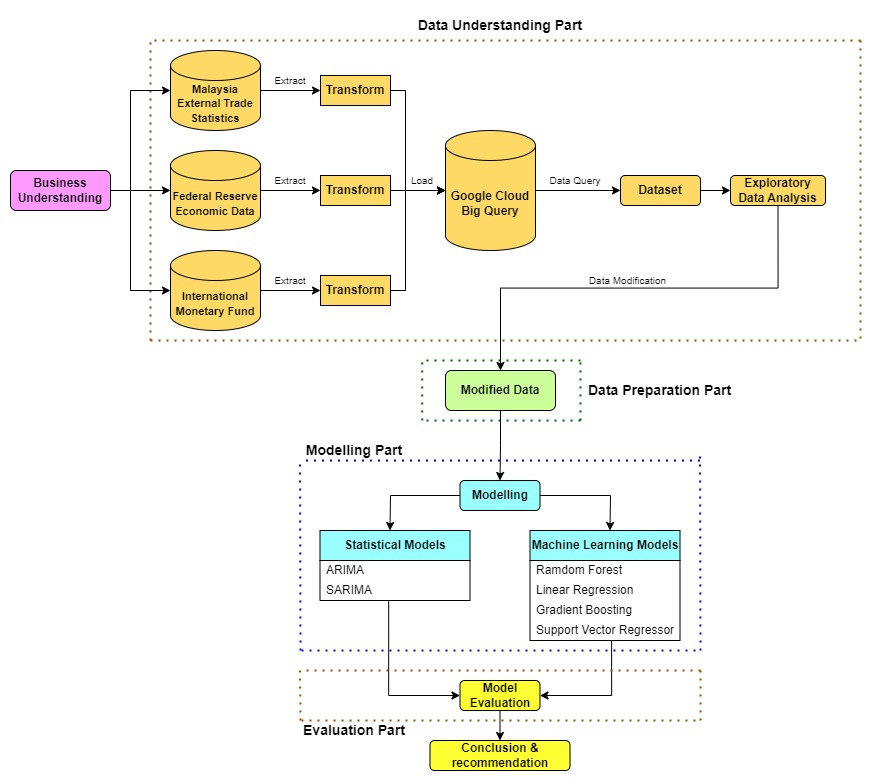

# Forecasting Malaysia's Total Export Value with Machine Learning Regression Models

## Research Objectives
1. To conduct exploratory data analysis to understand the relationship between world's total export value, US dollar to Malaysian Ringgit (USRMYR) exchange rate, real broad effective exchange rate (RBEER), Malaysia's total export and import value.
2. To develop predictive models using both statistical models and machine learning regression models in forecasting Malaysia's total export value and evaluate the models' performance.
3. To provide recommendations in improving the results of future research works related to forecasting international trade of a country.

## Research Workflow
<div>
    
</div>
A brief introduction on the research workflow adopted:

- **Business Understanding** phase: Critical for achieving the objectives by involving a deep analysis of the economic indicators, machine learning techniques and data selection via extensive literature review to understand international trade concepts, Malaysia's trade history, modeling techniques, and variables influencing Malaysia's total export value.
- **Data Understanding** phase: Encompasses several processes to gain a comprehesive understanding into the chosen datasets intended for both exploratory analysis and modeling. In this research, five key processes of data understanding have been implemented: **data collection**, **data description**, **data quality assessment**, **data exploration** and **data relationships**.
- **Data Preparation** phase: Focuses on feature engineering processes - **variable selection**, **conversion to stationary data** and **data transformation** to ensure the attributes/variables from the dataset are compatible for EDA and modelling purposes.
- **Modelling** phase: Implements statistical methods (**ARIMA** & **SARIMA**) and machine learning regression methods (**Random Forest**, **Linear Regression**, **Gradient Boosting** & **Support Vector Regressor**) to develop predictive models in forecasting Malaysia's total export value.
- **Evaluation** phase: Evaluates the models' performance based on two performance metrics - **Root Mean Square Error (RMSE)** and **R-squared value (R<sup>2</sup>)**.

## Research Outcomes
1. Malaysia's total export value positively correlates with its total import value, world's total export value and the USDMYR exchange rate.
2. Malaysia's total export value negatively correlates with Real Broad Effective Exchange Rate (RBEER).
3. **Best Performing Model**: The Linear Regression model, using an 80:20 data split ratio on stationary data has the best performance compared to the other predictive models.
4. **Macine Learning vs Statistical Models**: Machine learning regression models show better performance over statistical models due to their ability to handle complex and non-linear data, and can incorporate externabl variables to improve accuracy.
5.  **Limitations of Statistical Models**: Models like ARIMA and SARIMA underperform primarily due to the complexity and non-linearity data of Malaysia's total export value.
6. **Effectiveness of Machine Learning**: Machine learning regression models are deemed effective for forecasting Malaysia's total export value.

## Recommendations for Future Works
1. Broadening Research Scope: Future studies should aim to predict export values of specific commodities and explore other vairables affecting these values.
2. Incorporating Ganular Data such as daily data in the models to improve accuracy and insights.

## Guides for Replicating this Research Work
### Data Processing Workflows
1. Install all the necessary python packages according to this [requirements.txt](requirements.txt).
2. Follow the procedures of the data processing workflow according to [this](test_code_area.ipynb). It covers the following phases:
    - **ETL process** for each data sources (**Malaysia External Trade Statistics**, **Federal Reserve Economic Data** and **International Monetary Fund**).
    - **Data Query** from Google BigQuery and performed data integration using SQL joins.
    - **Data Modification** to conduct feature engineering process like data transformation to prepare the dataset for exploratory data analysis and modelling purporses.
    - **Data Exploration** and **Date Correlation** to plot charts to explore the complex relationships between the variables by plotting charts using `matplotlib` and `seaborn`.
    - Checked for data stationarity using Augmented Dickey Fuller (ADF) test via `statsmodels` and perform first order differencing to convert non-stationary time-series data to stationary.
    - Developed **statistical models** (**ARIMA** and **SARIMA**) and **machine learning regression models** (**Linear Regression, Support Vector Regressor, Random Forest, Gradient Boosting**) to predct Malaysia's total export value. The results of the charts plotted are stored in [here](/images/). The modelling part is carried out using python packages like `sklearn` and `pmdarima`.

### Setting Up Airflow using Docker for Windows
The procedures for setting up the airflow using Docker are as below:-
1. Download the docker desktop installer and install it.
2. Get the docker-compose.yaml file using either one of the commands:
    ```
    curl -LfO 'https://airflow.apache.org/docs/apache-airflow/2.8.1/docker-compose.yaml'
    ```
    or
    ```
    Invoke-WebRequest -Uri 'https://airflow.apache.org/docs/apache-airflow/2.8.1/docker-compose.yaml' -OutFile 'docker-compose.yaml'
    ```
    For details information of the file refer to this [guide](https://airflow.apache.org/docs/apache-airflow/stable/howto/docker-compose/index.html`).
3. For OS systems other than Linux, create an .env file in the same folder as docker-compose.yaml with the below content and add in the following line:
    `AIRFLOW_UID=50000`
4. Execute the below command to initiate the airflow.
    `docker compose up airflow-init`
5. Install the necessary packages into the airflow images by following this few steps:
    - Create a **Dockerfile** and include the lines as shown [here](/Dockerfile). You can update the base apache airflow image with your own version.
    - Run `docker build --tag name:tag .` , where **name** is the image name given to the newly build image and **tag** is the version.
    
        **Note*: Make sure the requirements.txt is available in the same directory.*
    
6. Run `docker compose up -d` to start the docker images in the background.

    **Notes*: The WSL2 should be installed in your window systems to run the Docker Desktop.*

### Configuring the Airflow DAGs for ETL Workflow
All the DAGs used in this project are listed in the [dags](/dags/) folder, where the subfolder - [scripts](dags/scripts/) is used to store the utilities functions.

The following tasks are covered by the DAGs:
- Extracting raw data from defined data sources.
- Transforming raw data to satisfy the project needs.
- Uploading a copy of the raw data and trasformed data to gcs.
- Loading the transformed data to big query.
- Triggering multiple dags concurrently.

For more information on airflow DAGs, refer [here](https://airflow.apache.org/docs/apache-airflow/stable/core-concepts/dags.html).